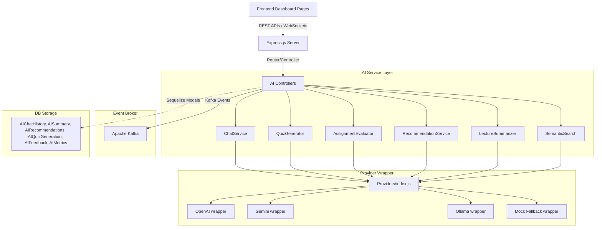

# FameHub AI Architecture

FameHub LMS incorporates a modular, robust, and highly scalable AI architecture that enhances teaching, learning, administration, and performance analytics. 

## Component Overview

### 1. Modular Provider Layer (`backend/src/ai/providers/`)
FameHub wraps provider SDKs in a unified interface exposing three core primitives:
* `getProviderName()`: Returns the configured provider (`openai`, `gemini`, `ollama`, or fallback `mock`).
* `chat(messages, options)`: Sends standard chat array payloads to LLMs and returns string responses or streams.
* `embed(text)`: Computes vector embeddings (float arrays) for semantic indexing.

### 2. Core AI Services (`backend/src/ai/services/`)
* **ChatService**: Manages student assistant histories and channels raw token streams via WebSockets.
* **QuizGenerator**: Reads pasted reference documentation to draft MCQs, multi-selects, and true/false questions.
* **AssignmentEvaluator**: Compares student responses with assignment descriptions and returns suggested grades, critiques, and plagiarism scores.
* **RecommendationService**: Dynamically reads attendance statistics, quiz logs, and assignment records to construct personalization plans.
* **LectureSummarizer**: Uses lecture recordings and transcript details to create revision questions, abstracts, key concepts, and study notes.
* **SemanticSearch**: Ranks reference items by computing cosine similarities between queries and document embeddings.

### 3. Kafka & WebSockets
* All major AI workflows emit structured messages to Zookeeper/Kafka event buses (e.g. `ai-chat-events`, `ai-quiz-events`, `ai-feedback-events`, `ai-summary-events`).
* Collaborative assistant interfaces rely on lightweight WebSockets to stream partial completions instantly to user dashboards with typing indicators.
