# FameHub System Diagrams & Workflows

This document contains Mermaid diagrams illustrating the FameHub LMS Enterprise Architecture, database structure, deployment topology, and messaging flows.

---

## 1. Software Architecture Diagram (System Topology)

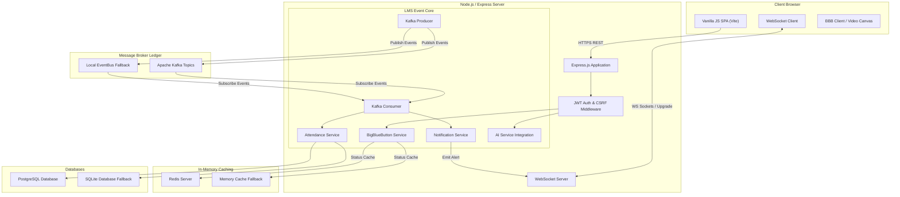

---

## 2. Entity-Relationship (ER) Diagram

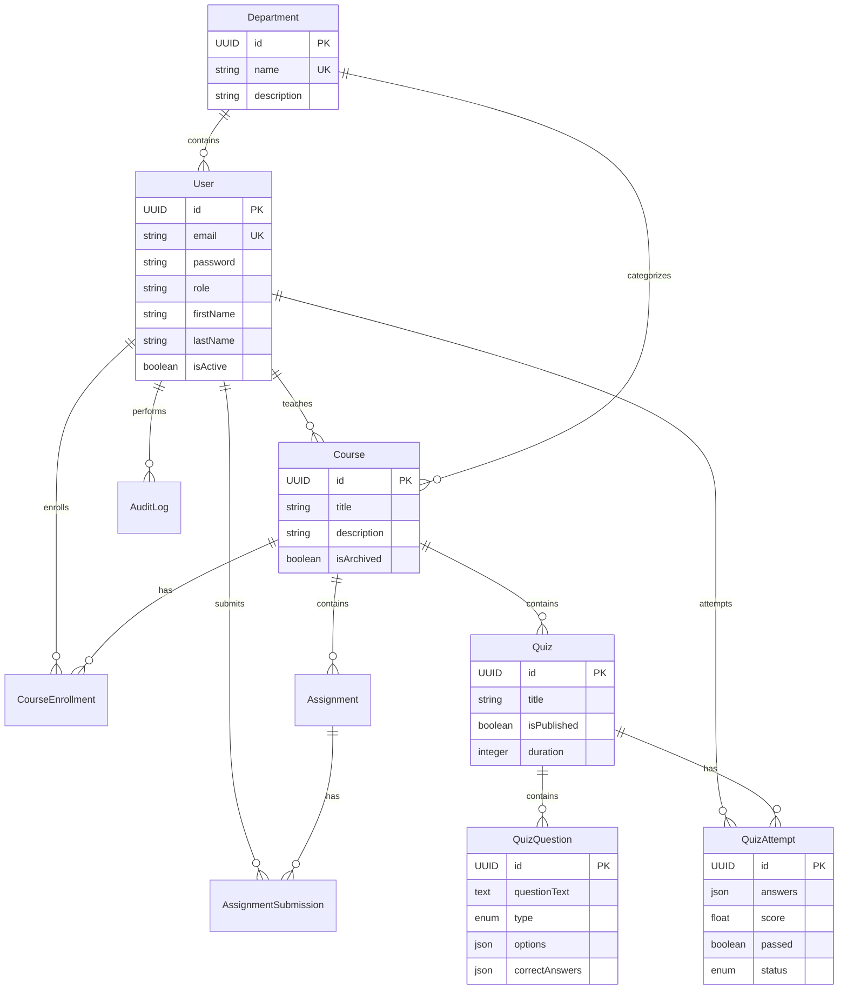

---

## 3. Deployment Diagram (Docker / Kubernetes Topology)

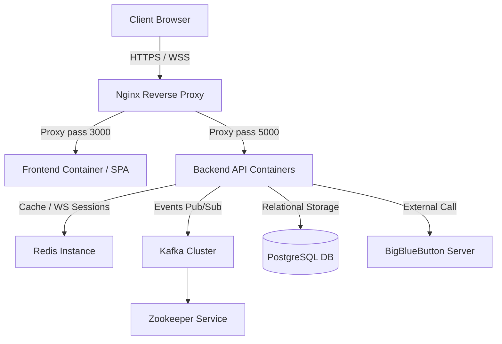

---

## 4. Kafka Event Flow Diagram

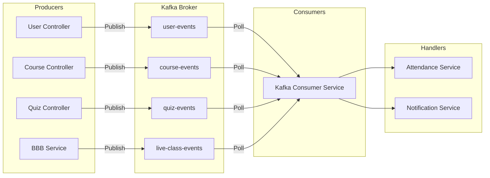

---

## 5. BigBlueButton Integration Diagram

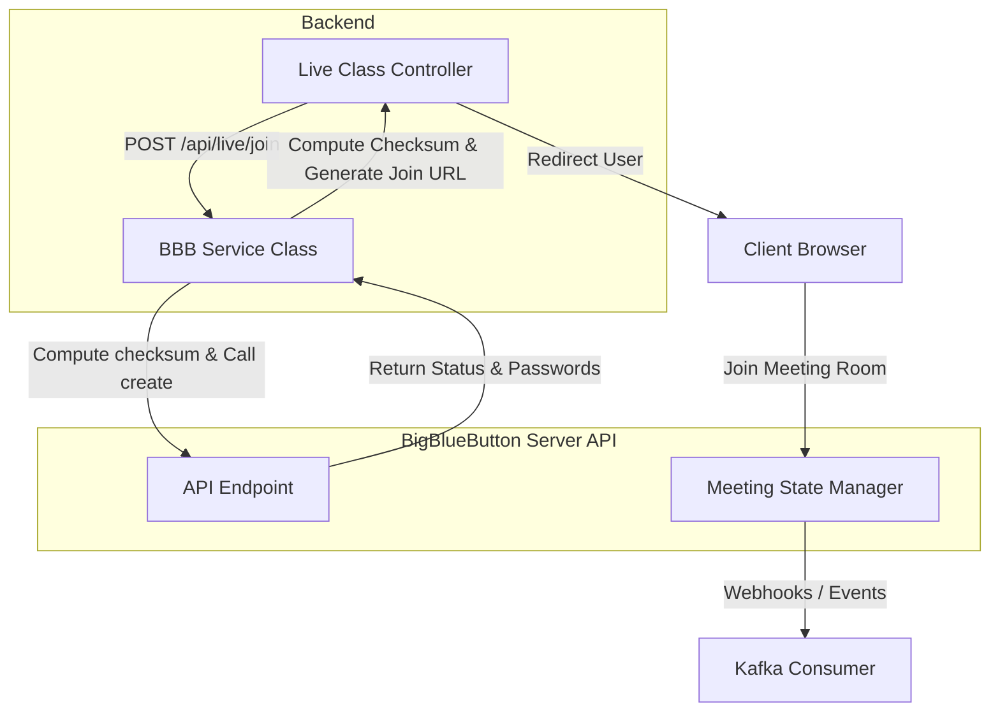

---

## 6. AI Architecture Diagram

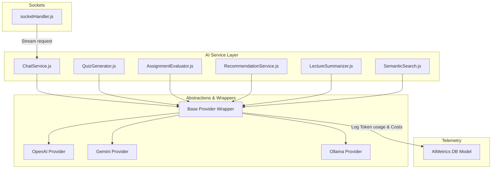

---

## 7. Sequence Diagrams

### Grade Submission Flow (Plagiarism & AI Assistance)
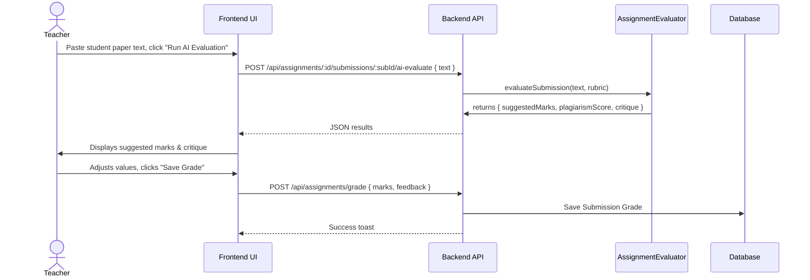

### WebSocket Chat Chunk Stream Flow
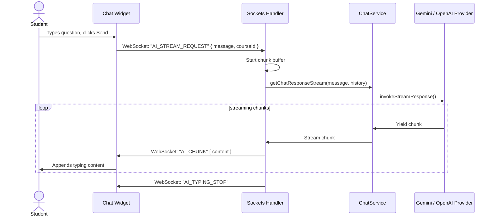

### AI Quiz Drafting Flow
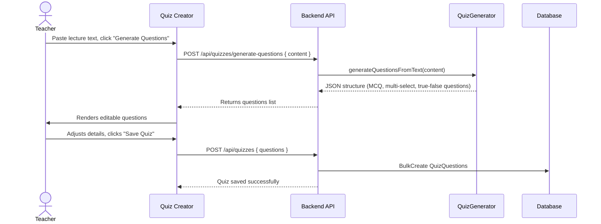

---

## 8. Component Diagram

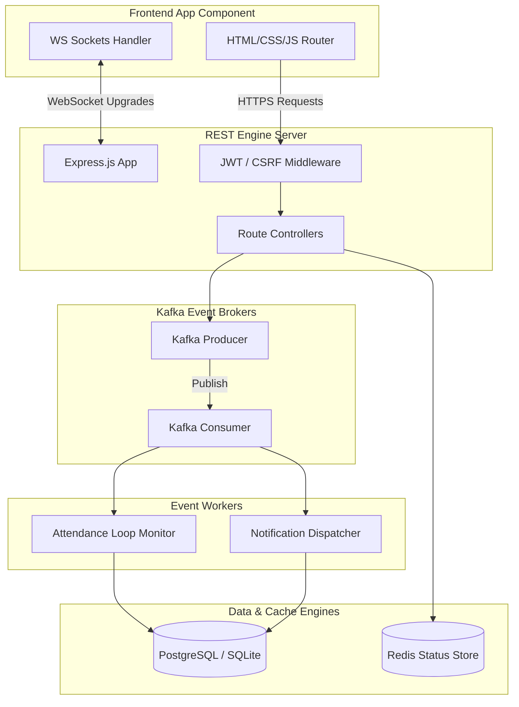

---

## 9. Class Diagram

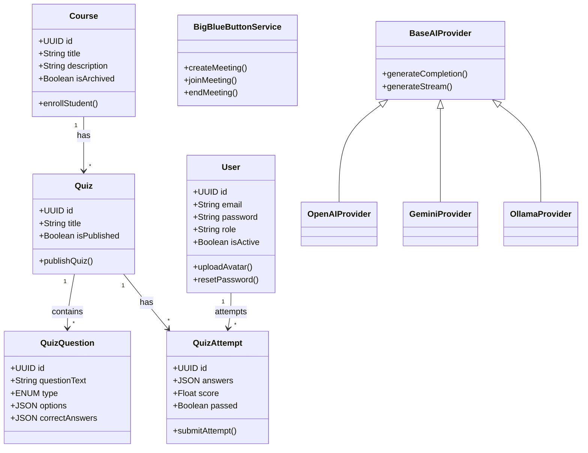
