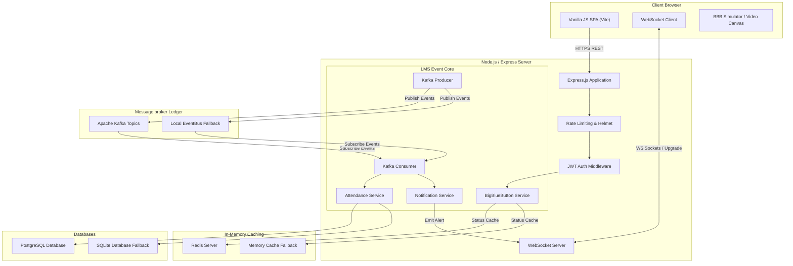
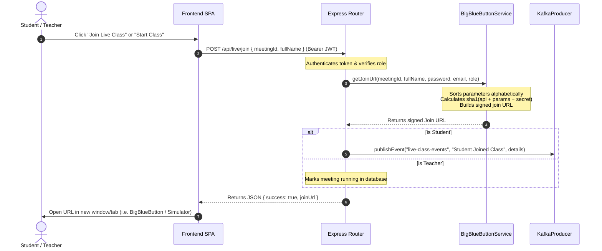
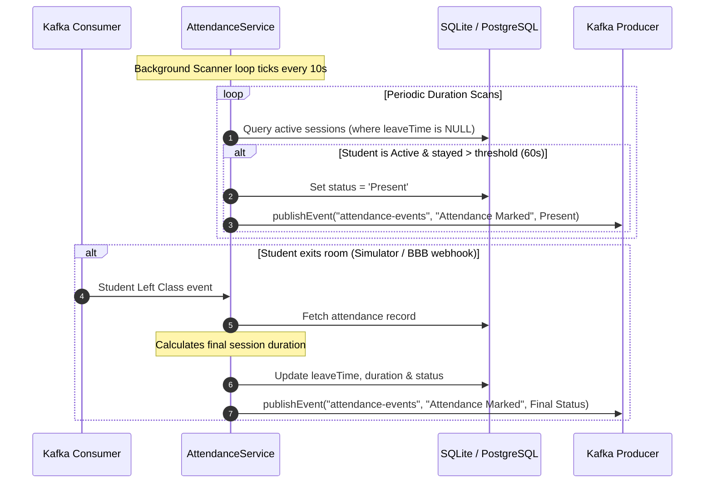
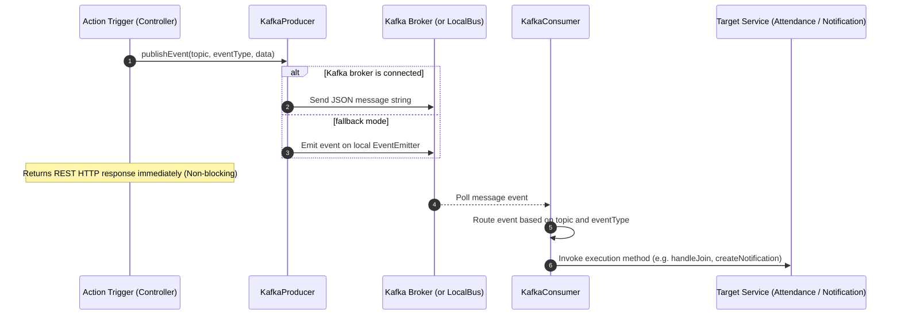
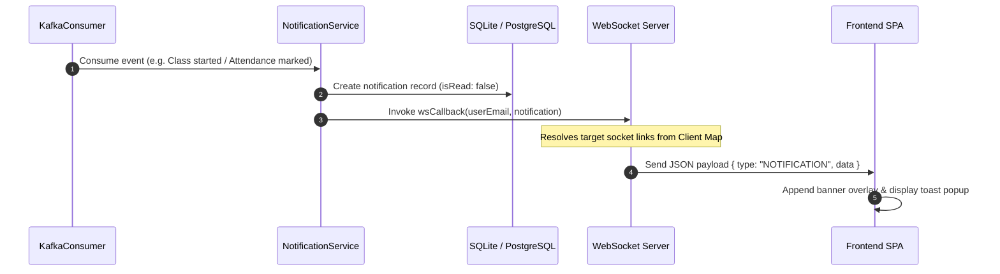

# FameHub System Diagrams & Workflows

This document contains Mermaid diagrams illustrating the FameHub Phase 2 Enterprise Architecture and execution sequence flows.

---

## 🏗️ System Architecture Topology

---

## 🎬 Sequence Flows

### 1. Join Meeting Workflow

This diagram maps how a user retrieves signed credentials to join a virtual room:

---

### 2. Attendance Monitoring Loop

Shows how attendance metrics are monitored dynamically based on classroom duration:

---

### 3. Kafka Event Pipeline

Illustrates the asynchronous event publishing and consumer routing loops:

---

### 4. WebSocket Notifications Flow

Maps how consumed background events result in instant visual toast popups in the browser:

